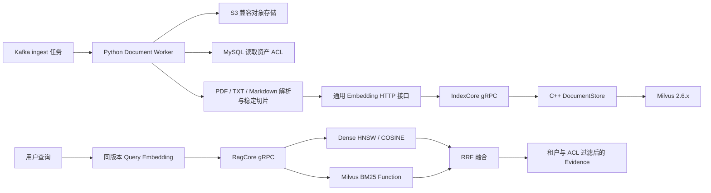

# 文档入库与 Milvus 混合检索

M07 把 M05 的对象存储资产和 M06 的 Kafka 任务接成第一条可工作的 RAG 数据链路：
Python 表层负责不可信输入、通用模型 API 和业务身份，C++ 内核负责索引结构与高频检索。



## 为什么这样拆分

- Python 下载对象时执行 100 MB 默认上限、事件大小和 SHA-256 三重校验，避免把损坏或超大文件送入解析器。
- PDF 使用 `pypdf==6.14.2`，TXT/Markdown 只接受 UTF-8；切片 ID 由资产版本、序号和内容摘要通过 UUIDv5 生成，Kafka 重试得到同一批主键。
- `EmbeddingModel` 只依赖 OpenAI-compatible 的 `POST /v1/embeddings` 形状，供应商、模型 ID、版本和维度都来自配置。响应必须完整覆盖输入顺序、维度正确且全部为有限浮点数。
- C++ 使用 `DocumentStore` 接口隔离存储实现。本地和测试用内存实现；生产构建可启用官方 Milvus C++ SDK v2.6.6。
- Python gRPC 客户端按 Protobuf 实际序列化大小把 `IndexAsset` 控制在 3 MB 以内：首批替换该资产版本，后续批次追加。任一后续批次失败时，Kafka 重试会重新从首批清空并重建，避免依赖 gRPC 默认 4 MB 上限。
- BM25 由 Milvus Function 根据原始 `content` 在服务端生成 sparse vector，并维护全局语料统计。Python 不维护第二套分词词表。
- dense 与 BM25 各取候选后用 RRF 融合。RRF 只依赖名次，避免 COSINE 与 BM25 分数尺度不同造成脆弱的人工权重。
- 两路检索都使用参数化 filter template 限制 `tenant_id` 和 `acl_id`；没有授权范围的查询在 Python/C++ 领域模型中都会被拒绝。

Milvus 的 BM25 Function、Hybrid Search 与 C++ 接口可参阅官方文档：[BM25 Function](https://milvus.io/docs/bm25-function.md)、[HybridSearch C++ API](https://milvus.io/api-reference/cpp/v2.6.x/Vector/HybridSearch.md)、[RRFRerank](https://milvus.io/api-reference/cpp/v2.6.x/Collections/Function.md)。中英混合默认使用 ICU tokenizer；可通过 `RAG_MILVUS_ANALYZER_PARAMS` 替换，并应在变更前用 Milvus analyzer 工具验证语料效果。

## 集合与版本策略

实际集合名为：

```text
rag_document_v1_<model-id-and-version-hash>_<dimension>
```

Milvus collection 的 dense vector 维度创建后不可改变，因此 Embedding 模型 ID、模型版本或维度任一变化都会进入新集合。旧集合可在切流、回填和回滚完成后再离线回收，不能原地覆盖。

集合包含稳定 `chunk_id` 主键、租户/ACL、资产与版本、对象 key、页码、标题、正文、内容摘要、模型身份、dense vector 和由 BM25 Function 生成的 sparse vector。Dense 使用 HNSW/COSINE，Sparse 使用 `SPARSE_INVERTED_INDEX`/BM25。

同一资产版本的重试采用“按租户与 `asset_version_id` 删除旧切片，再 upsert 新切片”。它保证最终幂等，但 Milvus 两次写入不是数据库事务；若进程在中间崩溃，Kafka 重试会重建完整版本。在对持续可读要求更高的环境，应升级为新 collection/partition 写完后原子切 alias 的方案。

## 配置与运行

Python 文档 worker 的主要配置：

```text
RAG_EMBEDDING_ENDPOINT_URL=http://model-gateway/v1/embeddings
RAG_EMBEDDING_API_KEY=...
RAG_EMBEDDING_MODEL_ID=embedding-general
RAG_EMBEDDING_MODEL_VERSION=2026-08
RAG_EMBEDDING_DIMENSION=1024
RAG_CORE_GRPC_INDEX_BATCH_MAX_BYTES=3000000
RAG_DOCUMENT_DOWNLOAD_MAX_BYTES=100000000
RAG_DOCUMENT_CHUNK_MAX_CHARS=1600
RAG_DOCUMENT_CHUNK_OVERLAP_CHARS=200
```

生成 gRPC 代码后启动 worker：

```bash
PYTHONPATH="${PWD}/build/generated/python" .venv/bin/rag-ingest-worker
```

`rag-document-worker` 仅作为兼容命令保留，实际同样启动统一的媒体类型路由 worker。

生产 C++ Core 使用 Milvus：

```bash
source build/conan/conanbuild.sh
cmake -S . -B build/cpp-milvus \
  -DCMAKE_TOOLCHAIN_FILE=build/conan/conan_toolchain.cmake \
  -DRAG_ENABLE_GRPC=ON \
  -DRAG_ENABLE_MILVUS=ON
cmake --build build/cpp-milvus --target rag_core_server --parallel

RAG_DOCUMENT_STORE=milvus \
RAG_MILVUS_URI=http://127.0.0.1:19530 \
RAG_MILVUS_TOKEN=root:Milvus \
  ./build/cpp-milvus/core/grpc/rag_core_server --listen 127.0.0.1:50051
```

默认构建和默认运行仍使用内存 store，便于无外部服务的开发与进程级契约测试；生产必须显式设置 `RAG_DOCUMENT_STORE=milvus`。

## 验证边界

```bash
./scripts/verify_document_retrieval.sh
```

脚本运行全部 Python 测试、生成双端契约、执行 Python→C++ 的 IndexAsset/ExecutePlan 闭环、编译官方 Milvus SDK 适配器并运行 C++ 测试。当前仓库没有自动启动真实 Milvus，所以上线前还需在集成环境验证 collection 创建、ICU 分词、BM25 结果、删除重试和大批量写入。

网络受限环境可通过 `RAG_MILVUS_SDK_SOURCE` 与 `RAG_MILVUS_PROTO_SOURCE` 指向已经校验版本的本地源码目录；正常环境无需设置。
