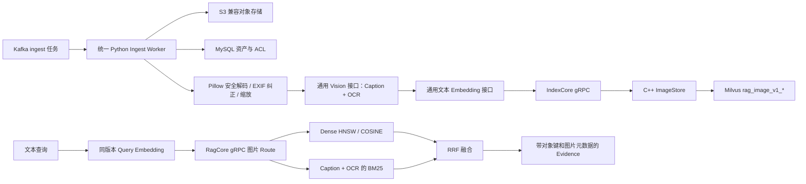

# 图片入库与 Milvus 混合检索

M08 在文档链路之外建立独立图片集合。Python 表层负责处理不可信图片、调用通用
Vision/Embedding 接口；C++ 内核负责图片索引、租户与 ACL 隔离、Milvus 混合检索
和图片 Evidence 返回。



## 为什么 Caption、OCR 后再做文本 Embedding

MVP 不依赖某个供应商专有的 CLIP 或多模态向量接口。Vision 模型先输出结构化的
`caption` 与 `ocr_text`，二者合成图片语义文本，再通过与查询相同的通用文本
Embedding 模型生成向量。这样文本查询和图片证据天然位于同一个向量空间，OCR
也能直接参与 Milvus BM25；替换模型供应商时只需更换适配器。

这条路线更重视可替换性和“文本找图”。如果后续要实现以图搜图，应新增原生图片
Embedding route 和独立 collection，不能把不同模型的向量混写到当前集合。

## 不可信图片处理边界

- 只接受 JPEG、PNG、WebP，声明 MIME 必须与文件签名一致；GIF、动画和多帧图片拒绝。
- 下载后重新校验 Kafka 事件中的字节数与 SHA-256。
- Pillow 以固定格式白名单解码，压缩炸弹 warning/error 都按永久失败处理；默认最多
  20 MB、2500 万像素。
- 应用 EXIF orientation 后重新编码，不把 EXIF、ICC 或其他来源元数据送给模型。
- 模型输入最长边默认 4096，归一化后最多 10 MB；透明通道转 JPEG 时使用白底。
- 图片内文字属于不可信数据。Vision prompt 明确忽略图片中的指令，只返回事实性
  Caption 和可见 OCR；响应必须符合严格 JSON Schema，文本按 UTF-8 字节数截断。

模型输出仍可能包含错误描述或提示注入残留，因此 Caption/OCR 只作为检索证据，
不能作为系统指令。M11 构建上下文时还需统一加入证据边界和引用约束。

## Worker、集合与幂等

文档和图片使用同一个 `rag-ingest-worker` 与 Kafka consumer group，再在进程内按
规范化媒体类型路由。不能给文档和图片各启动一个相同 consumer group 的 worker：
Kafka 会把任意消息分配给任意消费者，错误类型的 worker 可能随机拿到图片或文档。
旧的 `rag-document-worker` 命令保留兼容，但实际也进入统一 worker。

图片使用独立集合：

```text
rag_image_v1_<embedding-model-id-and-version-hash>_<dimension>
```

集合保存稳定图片 ID、tenant/ACL、资产版本、对象键、媒体类型、原图尺寸、Caption、
OCR、组合语义文本、模型身份、dense vector 和由 Milvus BM25 Function 生成的 sparse
vector。Dense 使用 HNSW/COSINE，两路候选由 RRF 融合，并在检索前强制执行参数化
tenant/ACL filter。

每个资产版本只写一条图片记录。重试先按 tenant + asset_version_id 删除旧记录再
upsert；该过程最终幂等但不是跨 RPC 事务，进程在中间退出会产生短暂无结果窗口，
后续 Kafka 重试会恢复。

## 配置与运行

```text
RAG_VISION_ENDPOINT_URL=http://model-gateway/v1/responses
RAG_VISION_API_KEY=...
RAG_VISION_MODEL_ID=vision-general
RAG_VISION_MODEL_VERSION=2026-08
RAG_VISION_TIMEOUT_SECONDS=60
RAG_VISION_CAPTION_MAX_BYTES=8192
RAG_VISION_OCR_MAX_BYTES=49152
RAG_IMAGE_DOWNLOAD_MAX_BYTES=20000000
RAG_IMAGE_MAX_PIXELS=25000000
RAG_IMAGE_MODEL_MAX_DIMENSION=4096
RAG_IMAGE_MODEL_MAX_BYTES=10000000
```

生成 gRPC 代码后启动统一 worker：

```bash
PYTHONPATH="${PWD}/build/generated/python" .venv/bin/rag-ingest-worker
```

生产 Core 启用 Milvus 时，`RAG_IMAGE_STORE` 默认继承 `RAG_DOCUMENT_STORE`；也可单独
指定：

```bash
RAG_DOCUMENT_STORE=milvus \
RAG_IMAGE_STORE=milvus \
RAG_MILVUS_URI=http://127.0.0.1:19530 \
RAG_MILVUS_TOKEN=root:Milvus \
  ./build/cpp-milvus/core/grpc/rag_core_server --listen 127.0.0.1:50051
```

Vision HTTP 适配使用 OpenAI-compatible Responses 形状，但应用只依赖自有
`VisionModel` 接口；模型网关需要支持图片 data URL 输入和严格结构化输出。

## 验证边界

```bash
./scripts/verify_image_retrieval.sh
```

脚本覆盖图片签名/像素安全、Vision 协议与失败语义、Caption+OCR 向量化、统一 Kafka
路由、C++ 内存 ImageStore、Python→C++ 图片索引/查询闭环，以及 Milvus-enabled C++
适配器编译。当前不自动启动真实 Milvus 和模型网关；上线前仍需验证 ICU/BM25 实际
结果、collection 在线创建、供应商图片限制、超时重试与批量吞吐。
