# 视频入库、时间片与 Milvus 检索

M09 把视频处理放在 Python 表层，把视频时间片的持久化和混合检索放在 C++20
内核。应用不依赖具体模型 SDK：语音识别使用 `SpeechToTextModel`，关键帧理解复用
`VisionModel`，向量化复用 `EmbeddingModel`。

## 处理流程

```mermaid
flowchart LR
    Kafka["Kafka ingest 任务"] --> Worker["Python 统一媒体 Worker"]
    Worker --> S3["S3 流式下载到临时文件"]
    S3 --> Probe["ffprobe 容器/时长/分辨率校验"]
    Probe --> Audio["FFmpeg 16 kHz 单声道 WAV 分片"]
    Probe --> Frames["FFmpeg 场景关键帧 + 60 秒兜底"]
    Audio --> ASR["通用 SpeechToTextModel\n带 segment 时间戳"]
    Frames --> Vision["通用 VisionModel\nCaption + OCR"]
    ASR --> Units["按关键帧边界组合时间片"]
    Vision --> Units
    Units --> Embed["通用文本 EmbeddingModel"]
    Embed --> GRPC["gRPC IndexAsset\n首批 replace / 后续 append"]
    GRPC --> Core["C++20 VideoStore"]
    Core --> Milvus["rag_video_v1_*\ndense + BM25 + RRF"]
    Milvus --> Evidence["Video Evidence\nstart_ms/end_ms/keyframe_ms"]
```

### 1. 流式下载与完整性

`ObjectStore.download_to_file` 以 1 MiB 块读取对象，在写入 worker 私有临时目录时
同步计算 SHA-256，并强制字节上限。下载完成后必须同时匹配 Kafka 事件中的大小和
摘要；无论成功还是失败，临时目录都会在任务结束时清理。这样 2 GB 视频不会被整体
保存在 Python 堆内存中。

### 2. 探测、音频分片与关键帧

- `ffprobe` 只接受声明 MIME 与实际容器一致的 MP4、QuickTime 或 WebM，并要求恰好
  一个视频流；时长、宽高和像素数受配置约束。
- 音频转成 16 kHz、单声道、16-bit PCM WAV，默认每 480 秒一片。单片约 15.4 MB，
  低于常见 OpenAI-compatible 转写接口的 25 MB 文件限制。
- 关键帧选择同时使用场景分数 `scene > 0.35` 和 60 秒最大间隔兜底，第一帧固定
  入选。输出数量有硬上限；若上限耗尽导致时间轴无法完整覆盖，任务会明确失败，
  不会静默产生超长时间片。
- FFmpeg/ffprobe 通过参数数组执行，不经过 shell；命令有总超时，输出帧还会进入
  M08 的 Pillow 安全归一化流程。

生产 worker 镜像必须安装同一受控版本的 `ffmpeg` 和 `ffprobe`。可通过
`RAG_FFMPEG_BINARY`、`RAG_FFPROBE_BINARY` 指向绝对路径。

### 3. 通用 ASR 契约

默认适配器向 OpenAI-compatible `/v1/audio/transcriptions` 发送 multipart 请求，
包含：

- `model=<RAG_SPEECH_MODEL_ID>`；
- `response_format=verbose_json`；
- `timestamp_granularities[]=segment`；
- 可选的 `language=<RAG_SPEECH_LANGUAGE>`。

供应商必须返回包含 `start`、`end`、`text` 的 `segments`。只有纯文本而没有时间戳
会被视为不兼容契约，因为系统无法生成可引用、可跳转的证据区间。HTTP 429/5xx、
超时和网络故障可重试；响应结构、越界时间戳等契约错误进入永久失败。

OpenAI 官方文档说明了文件转写、25 MB 上传限制和 segment 时间戳参数：
[Speech to text 指南](https://developers.openai.com/api/docs/guides/speech-to-text)、
[Transcriptions API](https://developers.openai.com/api/reference/resources/audio/subresources/transcriptions/methods/create)。
具体模型是否支持时间戳仍以所选供应商文档为准。

### 4. 时间片语义与稳定标识

每个关键帧开启一个时间片，下一关键帧是其结束边界，最后一片延伸到视频末尾。
时间片内容由 Caption、OCR 和与区间相交的 Transcript 组成。`unit_id` 使用
资产版本、序号、起止时间和内容摘要生成 UUIDv5；相同输入重试会得到相同主键。

每条 C++ `VideoSegment` 保存：

- tenant、ACL、资产版本和对象 key；
- `duration_ms`、`start_ms`、`end_ms`、`keyframe_ms`、宽高和媒体类型；
- Caption、OCR、Transcript、组合文本及 SHA-256；
- Embedding、Vision、Speech 三类模型的 ID 和版本。

Python gRPC 客户端按 Protobuf 实际字节数分批。第一批替换该资产版本，后续批次
追加；任务重试重新从第一批 replace 开始，因此中途失败不会保留无法收敛的旧结果。

### 5. Milvus collection 与召回

视频使用独立的 `rag_video_v1_<模型哈希>_<维度>` collection。模型 ID、版本或
维度变化都会进入新 collection，禁止把不同语义空间混合。

Milvus 同时维护 HNSW/COSINE dense 向量索引和服务端 BM25 sparse 索引，两路候选
使用 RRF 融合；tenant 和 ACL 参数化过滤在两路召回前执行。返回的 Video Evidence
包含起止毫秒，前端可以把 `start_ms / 1000` 设置为播放器起播时间，并把
`end_ms` 用作高亮区间。

Milvus 官方参考：
[BM25 Function](https://milvus.io/docs/bm25-function.md)、
[Multi-Vector Hybrid Search](https://milvus.io/docs/multi-vector-search.md)、
[RRF Ranker](https://milvus.io/docs/rrf-ranker.md)。

## 关键配置

| 配置 | 默认值 | 用途 |
|---|---:|---|
| `RAG_VIDEO_DOWNLOAD_MAX_BYTES` | 2,000,000,000 | 单视频流式下载上限 |
| `RAG_VIDEO_MAX_DURATION_SECONDS` | 14,400 | 最长视频时长 |
| `RAG_VIDEO_MAX_PIXELS` | 50,000,000 | 解码前宽×高校验上限 |
| `RAG_VIDEO_MAX_DIMENSION` | 16,384 | 单边尺寸硬上限 |
| `RAG_VIDEO_AUDIO_CHUNK_SECONDS` | 480 | ASR 音频分片长度 |
| `RAG_VIDEO_SCENE_THRESHOLD` | 0.35 | FFmpeg 场景变化阈值 |
| `RAG_VIDEO_KEYFRAME_MAX_GAP_SECONDS` | 60 | 无场景变化时关键帧最大间隔 |
| `RAG_VIDEO_MAX_KEYFRAMES` | 240 | 单视频关键帧硬上限 |
| `RAG_SPEECH_*` | 通用本地端点 | ASR 地址、密钥、模型和超时 |
| `RAG_VIDEO_STORE` | 跟随 `RAG_DOCUMENT_STORE` | `memory` 或 `milvus` |

## 验证边界

`./scripts/verify_video_retrieval.sh` 会运行 Python 单元测试、真实 Python→C++ gRPC
闭环、普通 C++ 测试和 Milvus-enabled 编译测试。如果开发机安装了 FFmpeg，还会
打印其版本；未安装时，命令生成、元数据解析、时间片覆盖和错误语义仍由 fake-process
单元测试覆盖，但真实编解码应在包含生产 FFmpeg 的镜像中补做集成测试。
